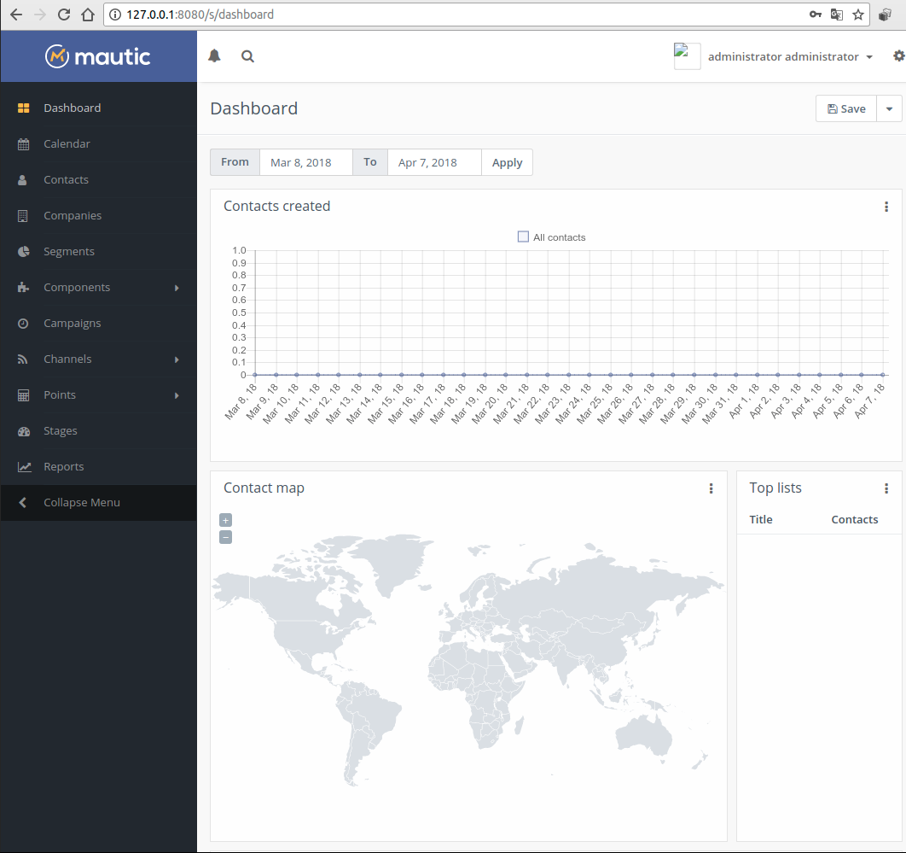
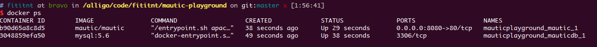
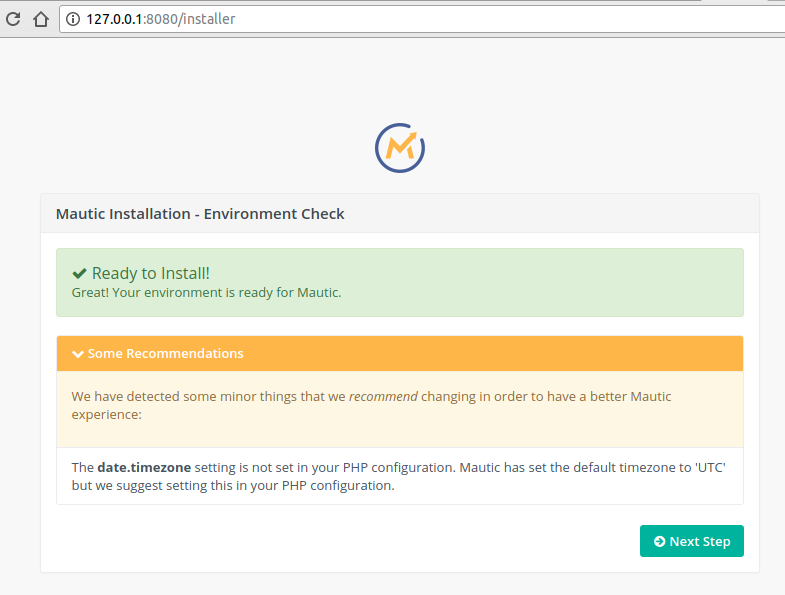
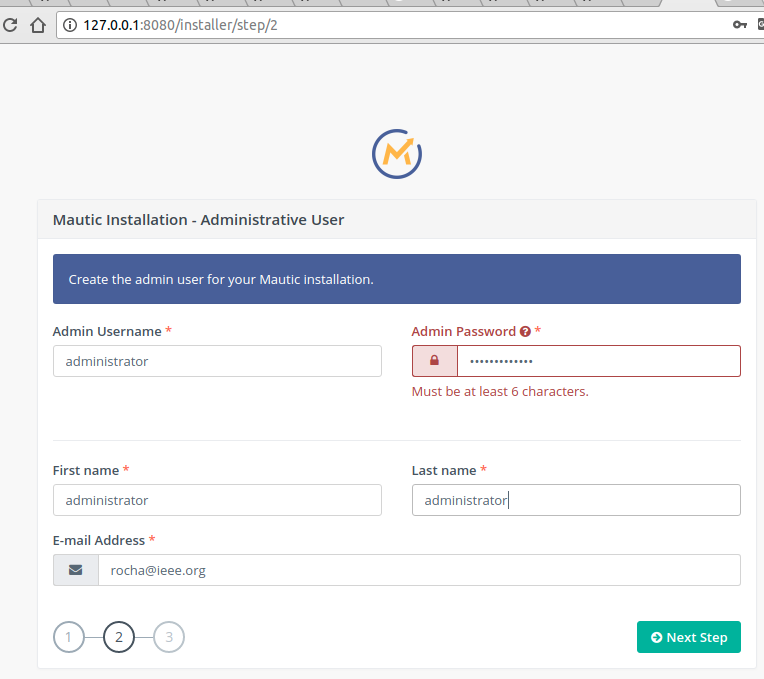
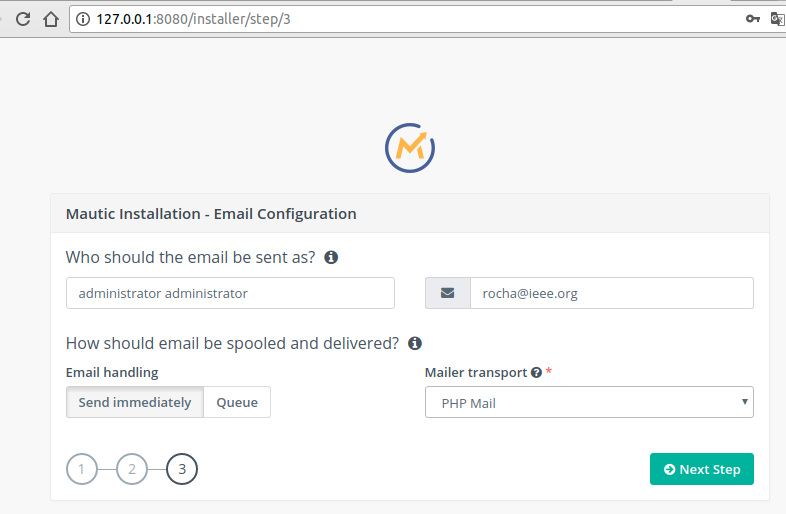
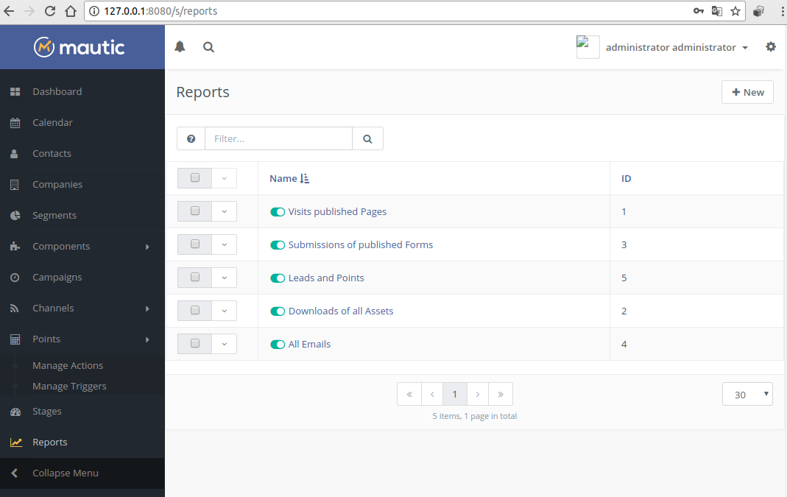

# mautic-playground
Rocha's playgrond for **Mautic: Open Source Marketing Automation Software**.

- Website: https://mautic.org
- GitHub: https://github.com/mautic/mautic
- [docker-compose.yml](docker-compose.yml) based on [vendor recommendation](https://github.com/mautic/docker-mautic)




## Logbook

```bash

## Created docker-compose.yml based on vendor recommendation at https://github.com/mautic/docker-mautic

docker-compose up
# Wait... 3min+

# Open http://localhost:8080 on your browser

## Stop and clean all resources (DO NOT RUN `docker-compose down --volumes --rmi all` ON PRODUCTION)
docker-compose down --volumes --rmi all

```

See [fulllogs.sh](fulllogs.sh).

## Screenshots









## Enviroment

```
## Ubuntu 16.04.4 LTS
# Requires Need docker and docker-compose. Used:

$ docker -v
Docker version 17.12.1-ce, build 7390fc6

$ docker-compose -v
docker-compose version 1.18.0, build 8dd22a9
```
